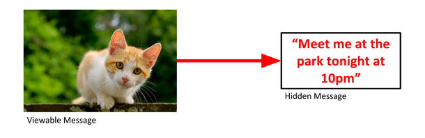
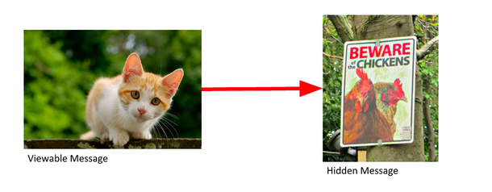
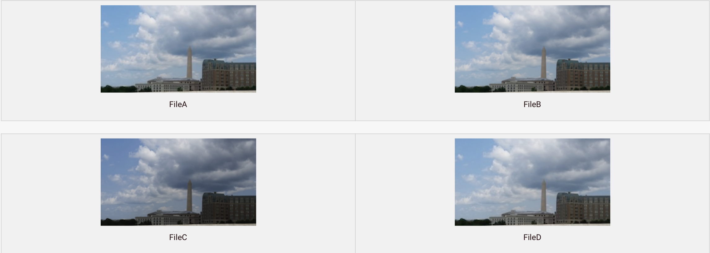
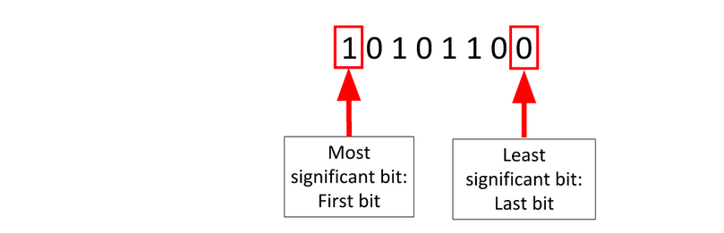
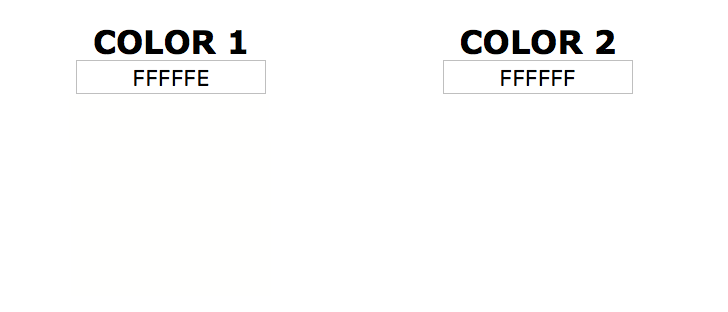
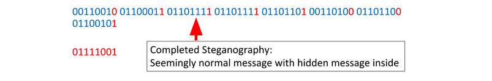

# استگانوگرافی (Steganography)

## مفاهیم پایه

قبل از یادگیری استگانوگرافی، بیایید چند مفهوم ساده رو یاد بگیریم:

### نمایش دودویی (Binary)

کامپیوترها همه چیز رو به صورت صفر و یک (0 و 1) ذخیره می‌کنن. این سیستم "دودویی" یا "باینری" نام داره. هر رقم (0 یا 1) یک **بیت** (bit) نامیده میشه.

[لینک مطالعه بیشتر](https://en.wikipedia.org/wiki/Binary_number)

مثال: عدد 5 در binary به صورت `101` نمایش داده میشه.

### بایت (Byte)

هشت بیت کنار هم یک **بایت** می‌سازن.
معمولا توی حافظه و دیسک، داده‌ها به صورت بایت ذخیره میشن. از تعریف بالا میتونید متوجه بشید یک بایت مثلا میتونه اعداد بین 0 تا 255 رو به صورت عادی ذخیره کنه. 

حالا اگر بین اعداد و حروف هم تناظر ایجاد کنیم، میتونیم بگیم هر کاراکتر هم یک بایت باشه. 

مثال: بایت `01000001` در استاندارد [ASCII](https://www.asciitable.com/) برابر با حرف 'A' هست.

### پیکسل و تصاویر

یک **پیکسل** کوچک‌ترین جزء یک تصویر دیجیتاله. هر تصویر از هزاران یا میلیون‌ها پیکسل ساخته شده.

### RGB و رنگ‌ها

هر پیکسل در یک تصویر رنگی با سه مقدار نمایش داده میشه:

- **R** (قرمز - Red)
- **G** (سبز - Green)  
- **B** (آبی - Blue)

هر کدوم از این مقادیر بین 0 تا 255 هست. برای مثال:

- `rgb(255, 0, 0)` — قرمز خالص
- `rgb(0, 255, 0)` — سبز خالص
- `rgb(255, 255, 255)` — سفید
- `rgb(0, 0, 0)` — سیاه

به اصطلاح میگیم در حالت عادی یک عکس 3 چنل داره. چنل قرمز، سبز و آبی. مثلا اگر ابعاد تصویر 1500 در 1500 پیکسله، میدونیم هر کدوم از این چنل‌ها، 1500*1500 بایت دارن و 
توی هر بایتشون بین 0 تا 255 شدت اون رنگ از چنل رو نوشته.

---

## استگانوگرافی چیست؟

استگانوگرافی هنر پنهان کردن داده‌ها توی چیزهای عادی دیگست که نشه فهمید اون چیز عادی پیام مخفی شده‌ای توش هست. مثلا توی عکس یا فایل صوتی

شما می‌تونید تصویری از یک گربه رو برای دوستتون بفرستید و متن رو توی اون پنهان کنید. با نگاه کردن به تصویر، هیچ چیز باعث نمیشه کسی فکر کنه پیامی توی اون پنهان شده.

شما همچنین می‌تونید یک تصویر دوم رو توی تصویر اول پنهان کنید.

## تشخیص استگانوگرافی

پس می‌تونیم متن و تصویر رو پنهان کنیم، چطوری می‌تونیم بفهمیم که آیا داده‌های پنهانی وجود داره؟

FileA و FileD یکسان به نظر می‌رسن، اما متفاوت ان. همچنین، FileD پس از کپی شدن تغییر کرده، پس ممکنه استگانوگرافی توی اون وجود داشته باشه.

FileB و FileC به نظر نمیرسه که پس از ایجاد شدن تغییر کرده باشن. این احتمال وجود استگانوگرافی توی اون‌ها رو رد نمیکنه، اما احتمال بیشتری وجود داره که اون رو توی fileD پیدا کنید. این دو سوال رو مطرح میکنه:

1. آیا می‌تونیم تشخیص بدیم که استگانوگرافی توی fileD وجود داره؟
2. اگر وجود داره، چه چیزی توی اون پنهان شده؟

## استگانوگرافی LSB

فایل‌ها از بایت‌ها ساخته شدن. هر بایت از هشت بیت تشکیل شده.

تغییر کم‌اهمیت‌ترین بیت (LSB) مقدار رو خیلی تغییر نمیده. نهایتا یکی به عدد اضافه یا یکی ازش کم میکنه.

پس می‌تونیم LSB رو بدون تغییر قابل توجه فایل تغییر بدیم. با انجام این کار، می‌تونیم پیامی رو توی اون پنهان کنیم. یعنی چون تغییر کمه، در کل تغییر زیادی نیست که بشه متوجهش شد.

### استگانوگرافی LSB در تصاویر

استگانوگرافی LSB یا _Least Significant Bit_ (کم‌اهمیت‌ترین بیت) روشی از استگانوگرافی هست که توی اون داده‌ها در کم‌اهمیت‌ترین بیت یک بایت store میشن.

فرض کنید یک تصویر در چنل مثلا R (قرمز)ش و در بایت پیکسل سطر 1000 و ستون 500ش، نوشته شده 255. ما میتونیم از بیت آخر این بایت استفاده کنیم و توش یک بیت از پیاممون رو بذاریم. همچنین برای باقی پیکسل‌ها هم این کاررو بکنیم. در نهایت به هر پیکسل نهایتا یکی اضافه کردیم یا یکی کم کردیم. اما همین یکی اضافه/کم شدن‌ها باعث شد ما بتونیم بیت‌های پیام خودمون رو توی تصویر بگنجونیم.

بذارید با مثال بگیم:

عدد 255  در binary به صورت `11111111` نمایش داده میشه. با این حال، تغییر اون به `11111110` چه تفاوتی ایجاد میکنه؟ چیز قابل توجهی نیست.

دلیل اینکه تشخیص استگانوگرافی با چشم دشواره اینه که تفاوت 1 بیتی در رنگ ناچیزه همونطور که در زیر مشاهده می‌کنید.

### مثال

فرض کنید یک تصویر داریم و بخشی از اون شامل binary زیره:

و فرض کنید می‌خوایم کاراکتر y رو توی اون پنهان کنیم.

ابتدا باید پیام پنهان شده رو به binary تبدیل کنیم.

حالا هر بیت رو از پیام پنهان شده برمی‌داریم و LSB بایت مربوطه رو با اون جایگزین می‌کنیم.

و دوباره:

و دوباره:

و دوباره:

و دوباره:

و دوباره:

و دوباره:

و یک بار دیگر:

decoding استگانوگرافی LSB دقیقاً همون encoding هست، اما به صورت معکوس. برای هر بایت، LSB رو بردارید و به پیام decoded شده خودتون اضافه کنید. پس از اینکه از هر بایت عبور کردید، تمام LSBهایی که برداشتید رو به text یا file تبدیل کنید.

## ابزارهای استگانوگرافی

برای استگانوگرافی LSB ساده که اینجا یاد گرفتید، ابزارهای مختلفی وجود داره که می‌تونید ازشون استفاده کنید. بعضی از این ابزارها آنلاینن و بعضی‌هاشون رو می‌تونید روی کامپیوتر خودتون نصب کنید. کافیه در موردش سرچ کنید.

